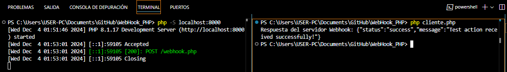

# 🎉 Webhook with PHP 

This project is a basic implementation of a **Webhook** in PHP. In this case, we have a server that listens for **POST** requests containing JSON data, processes the data, and returns a JSON response. Additionally, a PHP client sends a request to the Webhook to trigger the process.




---

## 🚀 **Technologies Used**  
- **Backend (Server)**: PHP (Webhook)  
- **Client**: PHP (using cURL to send the POST request)  
- **Server**: PHP Embedded Server  

---

## 📖 **Prerequisites**  
Before running this project, make sure you have the following components installed:  
1. **PHP 7.4 or later**  
2. **Git**  
3. A text editor like **Visual Studio Code** (optional).

---

## 🛠️ **Steps to Set Up and Run the Project**  

### 1️⃣ Clone the Repository  
Clone the project from GitHub using the following command:    
```
git clone https://github.com/ciizao/WebHook_PHP.git
```
### 2️⃣ Navigate to the Project Directory
Navigate into the directory where you cloned the project:
 ```
cd Webhook_PHP
```
### 3️⃣ Run the PHP Embedded Server
PHP comes with an embedded server you can use to test this project. Run the following command to start the server:
 ```
php -S localhost:8000
```
This command will start a web server at `http://localhost:8000`.

### 4️⃣ Execute the PHP Client
Once the PHP server is running, open a terminal and execute the PHP client:
 ```
php client.php
```

### 5️⃣ Verify the Response
The PHP client will send the data to the server and display the response from the Webhook. You should see a response like this:
`Response from Webhook server: {"status":"success","message":"Test action received successfully!"}`


## 📂 Repository
* The source code for this project is available on GitHub:
```
https://github.com/ciizao/WebHook_PHP.git
```